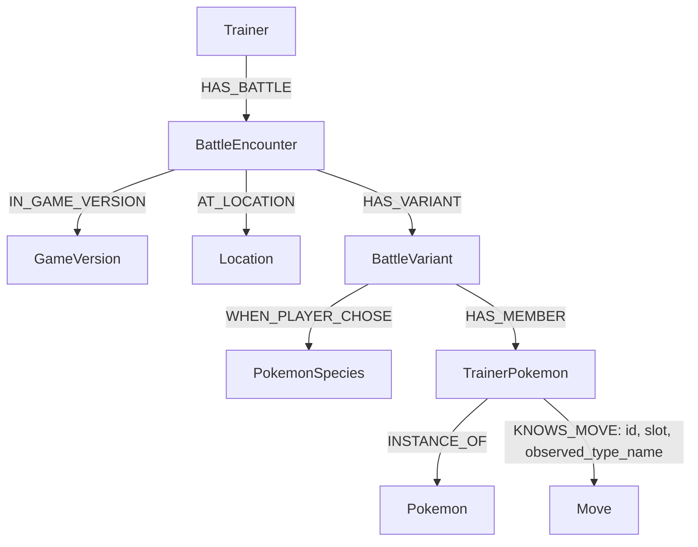

# Blue battle ingestion — Japanese Red/Green

The structured dataset contains 1 Trainer, 16 BattleEncounter, 48 BattleVariant,
198 TrainerPokemon and 702 direct KNOWS_MOVE relationships to existing Move nodes.
There are no TrainerMove nodes or Source nodes/properties in this battle import.
Existing PokéAPI Source nodes are untouched. The collector's sources.json remains
an offline collection manifest; the normalizer and writer do not consume it.



TrainerPokemon stores the team member's level and slot. Each KNOWS_MOVE stores
its stable relationship ID (`{member_id}:move:{slot}`), listed move slot and the
historical type observed in the battle table. EquippedMove is a Python payload
for that relationship, not a Neo4j label. Canonical Move and Pokemon properties
are never overwritten by this writer.

## Files

- collect.py: bounded page collection, HTML cleanup and footer exclusion.
- chunks.jsonl: 31 text chunks, including 24 starter-conditioned teams.
- sources.json: offline collection metadata and attribution, separate from ingestion.
- entity-mappings.json: read-only Neo4j reference snapshot.
- battle-fixture.json: manually reviewed first-battle reference.
- battles.jsonl: one nested record per battle/version; no source/evidence properties.
- battle-validation-report.json: preparation counts, canonical checks and gaps.
- normalize_battles.py: convenience entry point to pokegraph_ingest.battles.
- questions.jsonl: 26 development questions; question evidence remains in this offline file.
- battle-model-plan.md: model contract and implementation status.
- source-matrix.md: research source coverage, not a graph schema.
- [retrieval-strategy.md](retrieval-strategy.md): graph-first question routing, text retrieval filters, evidence handling, and follow-up implementation plan.
- validation.md: test instructions and verification history.

Questions `rg-q11-advantage`, `rg-q12-best-first`, and `rg-q13-catch-before`
use `{player_starter}` with `required_parameters: ["player_starter"]`.
This is a metadata label for now; parameter substitution and runtime enforcement
are not implemented. The value represents the player's original starter choice
(`bulbasaur`, `charmander`, or `squirtle`), even after it evolves. For q12, the
evidence list contains the three candidate branches; use only the chunk matching
the supplied starter. Supplying a starter does not resolve the remaining strategy
or progression evidence gaps.

## Test locally

Run from the repository root using the project virtual environment:

```sh
PYTHONPATH=src .venv/bin/python -m pokegraph_ingest.battles
PYTHONPATH=src .venv/bin/python -m pokegraph_ingest.battles --check
PYTHONPATH=src .venv/bin/python -m unittest tests.test_battles -v
```

The first command regenerates the dataset from local chunks and the saved mapping
snapshot. The second compares the stored payload with a fresh reconstruction and
changes nothing. To refresh only canonical references from Neo4j and rebuild files:

```sh
PYTHONPATH=src .venv/bin/python -m pokegraph_ingest.battles --refresh-mappings
```

## Test against Neo4j before persistent ingestion

Configure NEO4J_URI, NEO4J_USERNAME, NEO4J_PASSWORD and optionally NEO4J_DATABASE in
.env. The test needs write access and uses existing canonical Pokémon/moves/games:

```sh
PYTHONPATH=src POKEGRAPH_BATTLE_INTEGRATION=1 .venv/bin/python -m unittest tests.integration.test_battle_ingest -v
```

All test battle writes are in one transaction that is rolled back, even on test
failure. It checks counts, queries, repeated loads, changed-reference rejection,
unchanged canonical properties and absence of old source/move-node relationships.
It does not install schema constraints persistently.

## Persist and verify

Progress logs include timestamps, phase, per-battle preflight/write/commit status,
committed battle counts and elapsed time. Logs go to stderr; the final JSON stays
on stdout. `--log-level DEBUG` additionally shows node/relationship batches;
`--log-level ERROR` suppresses normal progress. Connection settings and raw driver
exception payloads are not logged. On failure, logs identify the stage, battle
and number of earlier committed battles; the command exits nonzero.

To save logs and the report separately:

```sh
PYTHONPATH=src .venv/bin/python -m pokegraph_ingest.battles --write > ingestion-report.json 2> ingestion.log
```

```sh
PYTHONPATH=src .venv/bin/python -m pokegraph_ingest.battles --write
PYTHONPATH=src .venv/bin/python -m pokegraph_ingest.battles --verify-server
```

`--write` rechecks canonical references, requires the reviewed file to match its
reconstruction, applies four battle node constraints, and writes one complete
battle per transaction. Repeating the identical import does not create duplicates.
If a later battle fails, earlier transactions remain committed and the same input
can be retried. Structural changes require explicit reconciliation.

`--verify-server` is read-only. Expected counts: Trainer 1, BattleEncounter 16,
BattleVariant 48, TrainerPokemon 198, KNOWS_MOVE 702. Additional checks must all
return zero: legacy TrainerMove nodes, HAS_MOVE/USES_MOVE/HAS_SOURCE relationships
in this battle scope, source properties, invalid equipped-move properties and
duplicate move slots. The checks are in queries/battles/verify_ingestion.cypher.

Use queries/battles/team_for_battle.cypher with trainer_id='trainer:blue',
version_id=44, battle_key='first', starter_species_id=1, skip=0 and limit=50.
Expected: Charmander level 5, Scratch in slot 1 and Growl in slot 2. Repeat with
version_id=45. These are standalone queries, not HTTP endpoints.

If a previous TrainerMove/Source battle import already exists, the writer refuses
to mix schemas. Reconcile that scoped import before proceeding; do not delete
canonical Move, Pokemon or existing PokéAPI Source records. This implementation
adds no automatic legacy deletion or global Source/constraint removal.

## Known gaps

Games 44/45 map to VersionGroup 28 (red-green-japan). Professor Oak's Laboratory
maps to `pallet-town` and Silph Co. maps to `saffron-city` through `AT_LOCATION`.
These are containing-city mappings; `location_name` retains the building name.
The importer reuses existing canonical Location nodes. Progression is partial for battles 1,2,3,4,7 and unknown
for 5,6,8. Battle order is the source order, not a mandatory progression chain.
No embeddings or vector index are created by this importer.

## Offline attribution

Collected text is by Bulbapedia contributors under the Attribution-NonCommercial-
ShareAlike 2.5 notice recorded with the snapshots. Original URLs and collection
metadata remain in the offline corpus. They are not included in battle graph
properties. See sources.json and the original source-matrix.md for provenance.
